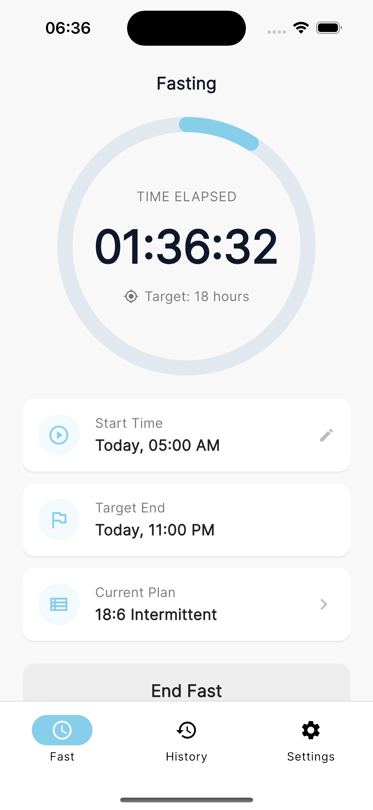
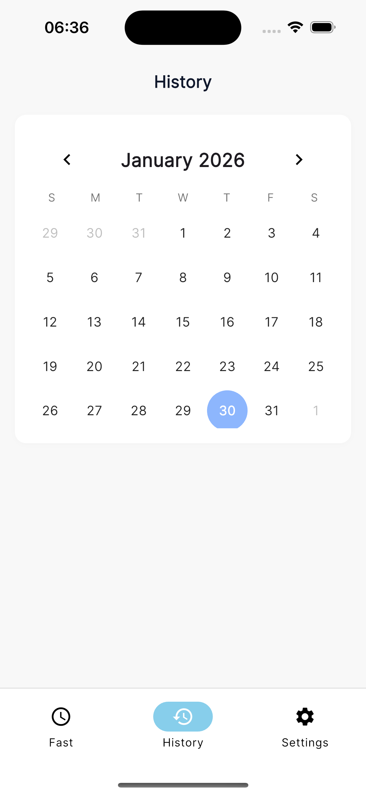
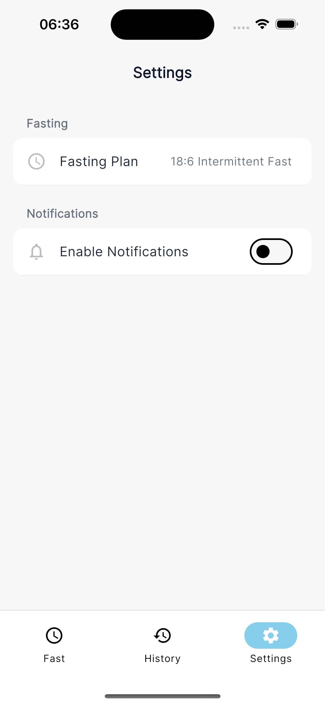

---
A **simple, minimal, and fully offline tracker** for monitoring your intermittent fasting habits. Your data stays **100% local**, no cloud, no account.

## Features

- **Offline-only:** All data is stored locally on your device.
- **Minimal & lightweight:** Focused on tracking fasts without clutter.
- **Easy to use:** Start, stop, and view your fasting history.
- **Privacy-first:** No data leaves your device.

## Screenshots

